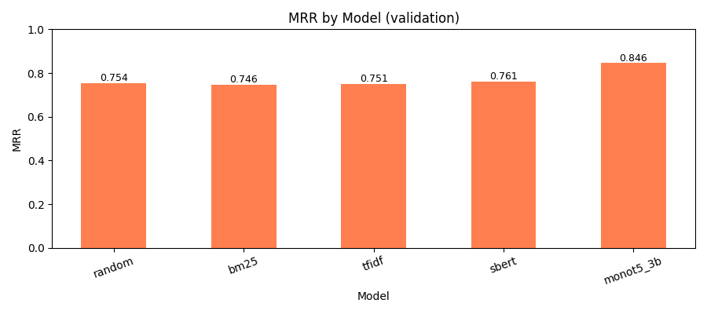
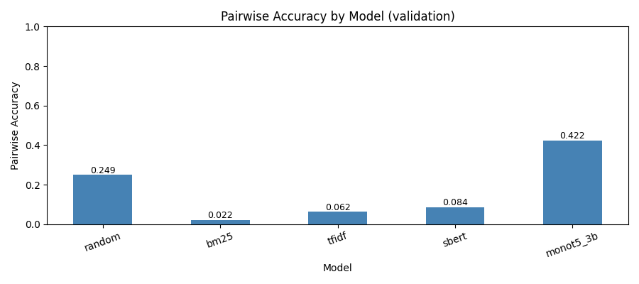
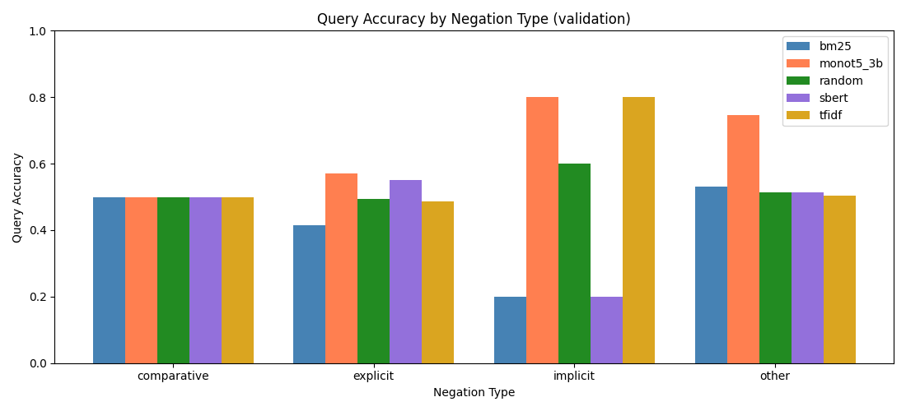
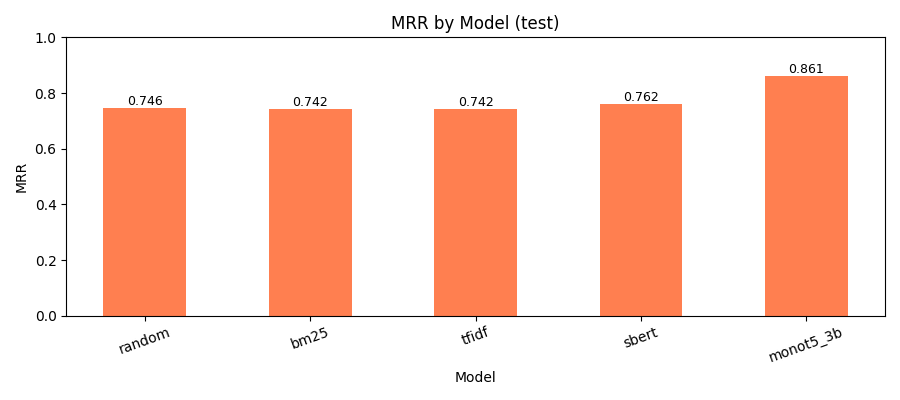
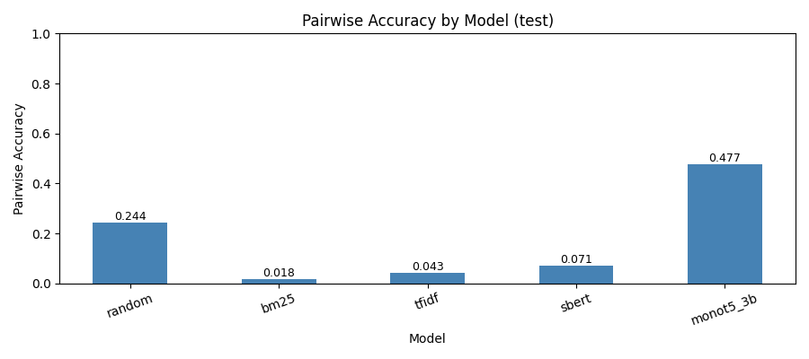
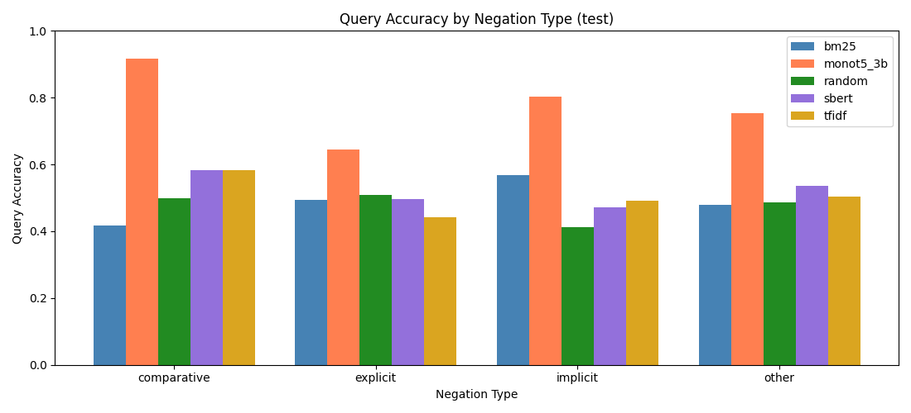

# Negation-Lens

Negation-Lens is an information retrieval project that tests how well common retrieval models understand negation.

The project uses the NevIR dataset, where each example contains two related queries and two related documents. The task is simple to state:

```text
q1 should retrieve doc1
q2 should retrieve doc2
```

The paired queries often differ by negation or a meaning reversal, such as `not`, `without`, `cannot`, `less than`, or antonym-style wording. This makes the dataset useful for checking whether a retrieval model is matching meaning or only matching surface words.

## What This Repo Includes

- NevIR train, validation, and test CSV files
- Random, BM25, TF-IDF, Sentence-BERT, and MonoT5 retrieval baselines
- Query-level accuracy, pairwise accuracy, and MRR evaluation
- Rule-based negation type labels: `explicit`, `implicit`, `comparative`, and `other`
- Final result tables, plots, and selected error examples

## Models

The current pipeline evaluates:

```text
random
bm25
tfidf
sbert
monot5_3b
```

`sbert` uses Sentence-BERT with `sentence-transformers/all-MiniLM-L6-v2`.

`monot5_3b` uses the MonoT5 3B cross-encoder model `castorini/monot5-3b-msmarco-10k`.

## Dataset

Dataset source: [orionweller/NevIR on Hugging Face](https://huggingface.co/datasets/orionweller/NevIR)

The dataset splits are stored locally:

```text
data/train.csv
data/validation.csv
data/test.csv
```

Each CSV uses this structure:

```text
id, WorkerId, q1, q2, doc1, doc2
```

For every row, `q1` should match `doc1`, and `q2` should match `doc2`.

## Setup

Create a virtual environment:

```bash
python3 -m venv .venv
```

Activate it on Linux/macOS:

```bash
source .venv/bin/activate
```

Activate it on Windows PowerShell:

```powershell
.\.venv\Scripts\Activate.ps1
```

Install the standard dependencies:

```bash
python -m pip install -r config/requirements.txt
```

To run `sbert`, `monot5_3b`, or `all`, install the dense retrieval dependencies too:

```bash
python -m pip install -r config/requirements-dense.txt
```

Sentence-BERT and MonoT5 download their models from Hugging Face the first time they run. MonoT5 3B is a large model, so GPU runtime is recommended. If you do not want these downloads, run only `random`, `bm25`, or `tfidf`.

## Run Evaluation

Run all models on validation:

```bash
python src/evaluate.py --split validation --model all
```

Run all models on test:

```bash
python src/evaluate.py --split test --model all
```

Run a single model:

```bash
python src/evaluate.py --split validation --model bm25
```

Supported splits:

```text
validation, test
```

Supported models:

```text
random, bm25, tfidf, sbert, monot5_3b, all
```

## Build Report Files

After running evaluation, build the final report outputs:

```bash
python src/report.py
```

This creates final comparison tables, plots, and selected error examples in `results/`.

## Results

### Validation

```text
model   query_acc   pairwise_acc   mrr     query_cases
random  0.509       0.249          0.754   450
bm25    0.491       0.022          0.746   450
tfidf   0.502       0.062          0.751   450
sbert   0.522       0.084          0.761   450
monot5  0.691       0.422          0.846   450
```

### Test

```text
model   query_acc   pairwise_acc   mrr     query_cases
random  0.492       0.244          0.746   2766
bm25    0.484       0.018          0.742   2766
tfidf   0.484       0.043          0.742   2766
sbert   0.523       0.071          0.762   2766
monot5  0.722       0.477          0.861   2766
```

MonoT5 3B gives the strongest results, reaching 47.7% pairwise accuracy on the test split. The contrast between Sentence-BERT and MonoT5 shows why cross-encoders are much better suited to paired negation ranking than basic similarity models.

## Metrics

`query_acc` checks each query independently.

`pairwise_acc` is stricter. A dataset row is counted as correct only if both `q1` and `q2` retrieve the right document.

`mrr` means Mean Reciprocal Rank. Higher is better.

## Negation Type Labels

The project also labels queries with simple rule-based categories:

```text
explicit      Direct negation words such as not, no, never, cannot, or n't
implicit      Absence-style words such as without, except, lack, or lacking
comparative   Comparison phrases such as less than, more than, at least, or at most
other         Queries that do not match the simple keyword rules
```

These labels are used for per-type result breakdowns.

## Output Files

Evaluation outputs:

```text
results/validation_predictions.csv
results/validation_model_metrics.csv
results/validation_negation_type_metrics.csv
results/test_predictions.csv
results/test_model_metrics.csv
results/test_negation_type_metrics.csv
```

Final report outputs:

```text
results/final_model_comparison.csv
results/final_per_type_comparison.csv
results/error_examples.csv
results/plots/
```

## Plots

Validation:







Test:







## Project Structure

```text
config/
  requirements.txt           Standard dependencies
  requirements-dense.txt     Sentence-BERT and MonoT5 dependencies

data/
  train.csv
  validation.csv
  test.csv

results/
  Final CSV outputs and plots

scripts/
  download_nevir_data.py     Dataset download helper

src/
  nevir_data.py              Load data and create query cases
  metrics.py                 Calculate query accuracy, pairwise accuracy, and MRR
  negation_labeler.py        Label queries by simple negation type rules
  random_baseline.py         Random baseline
  bm25_baseline.py           BM25 baseline
  tfidf_baseline.py          TF-IDF baseline
  sbert_baseline.py          Sentence-BERT baseline
  cross_encoder_baseline.py  MonoT5/cross-encoder baseline
  evaluate.py                Main evaluation runner
  report.py                  Build final tables, plots, and error examples
```

---

<h2 align="center">Thanks for Checking This Out 👋</h2>

<p align="center"><em>Read the query carefully. Track the negation. Retrieve the meaning, not just the matching words.</em></p>
